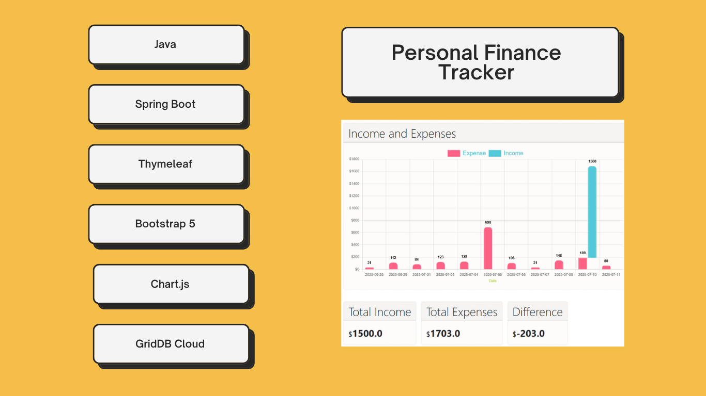
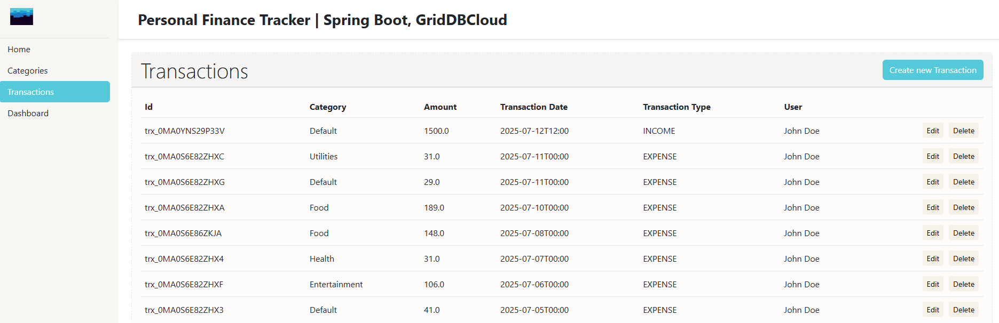
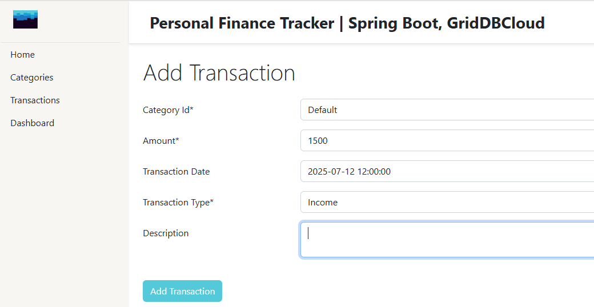
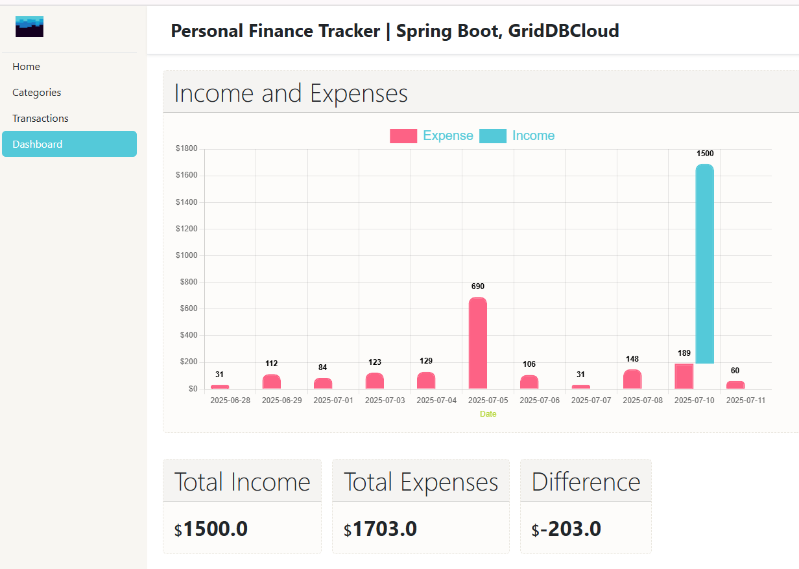

# Developing a Personal Finance Tracker Application with Spring Boot, Thymeleaf, and GridDB Cloud database



---

This blog post provides a comprehensive, step-by-step guide to **Developing a Personal Finance Tracker Web with Spring Boot, Thymeleaf, and GridDB Cloud database**. If you're looking to build a full-stack Java web application from scratch, this tutorial is the perfect place to start. We will walk you through the entire process, from initializing the project to creating a functional application that can track your income and expenses.

You will learn how to leverage the power of the **Spring Boot** framework to rapidly build a robust backend and web application, including setting up Web controllers, RESTful controllers, service layers, and data repositories. For the database, we will use **GridDB Cloud**, a powerful and scalable time-series NoSQL database, which is an excellent choice for handling financial data. We'll cover how to seamlessly connect a cloud instance to our Spring application.

On the frontend, you'll see how **Thymeleaf**, a modern server-side template engine, integrates with Spring Boot to create dynamic and interactive web pages. We will build user-friendly interfaces to display a list of all transactions, show a summary of your financial transaction with charts, and add new entries through a simple form. By the end of this article, you will have not only a practical personal finance application, but also a solid understanding of how these three powerful technologies work together. This hands-on project will equip you with valuable skills applicable to a wide range of web development scenarios.

---

## Core Features

Before delving into the technical aspects of the web application development, let's write down the core features.

* Add a new transaction (date, description, category, amount, type - income/expense).
* View a list of transactions.
* Edit existing transactions.
* Display a summary (total income, total expenses).
* Categorization of transactions (e.g., Salary, Groceries, Rent, Transport).
* Basic dashboard view.

## Prerequisites & Project Setup

First, let's make sure we have everything installed: 
- [Java 17 or later](https://jdk.java.net/21/), [Maven 3.5+](https://maven.apache.org/download.cgi), and your favorite text editor ([Intellij IDEA](https://spring.io/guides/gs/intellij-idea/), or [VS Code](https://spring.io/guides/gs/guides-with-vscode/))

- A GridDB Cloud account. You can sign up for a GridDB Cloud Free instance at https://form.ict-toshiba.jp/download_form_griddb_cloud_freeplan_e.

After completing the prerequisites, we'll start create a new Spring Boot application, which is surprisingly quick thanks to [Spring Initializr](https://start.spring.io/). You can use this [pre-initialized project](https://start.spring.io/#!type=maven-project&language=java&platformVersion=3.5.3&packaging=jar&jvmVersion=21&groupId=com.example&artifactId=springboot-pft&name=springboot-pft&description=Personal%20Finance%20Tracker%20using%20Spring%20Boot&packageName=com.example.springbootpft&dependencies=web) and click Generate to download a ZIP file. This will give us the basic structure, and then we'll add the necessary dependencies.

> Note: To skip starting from scratch, you can clone the source repository [here](https://github.com/alifruliarso?tab=repositories).

### Configuring the GridDB Cloud Connection

To connect to the GridDB Web API via HTTP Requests, we have to get the base URL and include basic authentication in the HTTP Request's headers. You can set up and get these by following [the GridDB Cloud quick start guide.](https://griddb.net/en/blog/griddb-cloud-quick-start-guide/)

Add those values into `src/main/resources/application.properties`.

1. Using plain text


```
# GridDB Configuration
griddbcloud.base-url=https://cloud5197.griddb.com:443/griddb/v2/gs_cluster
griddbcloud.auth-token=TTAxxxxxxx
```

> ***auth-token***: Base64 encoded string of the username and password, separated by a colon.

2. Or using environment variables from OS or command-line arguments or IDE configuration.

```
# GridDB Configuration
griddbcloud.base-url=${GRIDDBCLOUD_BASE_URL}
griddbcloud.auth-token=${GRIDDBCLOUD_AUTH_TOKEN}
```

## Building the Backend Logic

First, let's add the required dependencies as follows:

```xml
<dependency>
    <groupId>org.springframework.boot</groupId>
    <artifactId>spring-boot-starter-thymeleaf</artifactId>
</dependency>
<dependency>
    <groupId>nz.net.ultraq.thymeleaf</groupId>
    <artifactId>thymeleaf-layout-dialect</artifactId>
</dependency>
<dependency>
    <groupId>org.springframework.boot</groupId>
    <artifactId>spring-boot-starter-test</artifactId>
    <scope>test</scope>
</dependency>
<dependency>
    <groupId>com.github.f4b6a3</groupId>
    <artifactId>tsid-creator</artifactId>
    <version>5.2.5</version>
</dependency>
```

* The `spring-boot-starter-thymeleaf` will auto-configure everything needed to use the Thymeleaf template engine. The Thymeleaf templates are simple HTML static file (`.html` extension). The template files by default located at `src/main/resources/templates` folder.

* The `spring-boot-starter-test` provides Spring Test, JUnit, and Mockito dependencies for writing effective tests.

* `tsid-creator`: a Java library for generating Time-Sorted Unique Identifiers (TSID). A TSID is a number that is formed by the creation time along with random bits. We'll use this library for generating IDs.

Next, create the package structure based on the technical layers as follows:

```sh
com.example.springbootpft
├── config
├── controller
├── model
├── service
├── util
├── webapi
```

Before we build the View and Controller layer, we should have the Model layer, that represents our data structure, mirroring our database table. In this post, we will maintain 3 domain: User, Category, and Transaction as follow:

```java
//TransactionRecord.java
public record TransactionRecord(String id, String categoryId, Double amount, LocalDateTime transactionDate, String transactionType, String description, String userId) {}

//CategoryRecord.java
public record CategoryRecord(String id, String name) {}

//UserRecord.java
public record UserRecord(String id, String email, String fullName) {}
```

Next, we bind the config values from `application.properties` to a Java class by using `ConfigurationProperties` annotation.

```java
@Component
@ConfigurationProperties(prefix = "griddbcloud")
public class GridDbCloudClientProperties {
	private String baseUrl;
	private String authToken;
	// Setter and Getter
}
```

> Tip: You can generate Setters and Getters by using VS Code extension Code Generator For Java

Next, we'll create `GridDbCloudClient` class, that encapsulates the plumbing required to communicate with GridDB Cloud via HTTP.

```java
public class GridDbCloudClient {
    private final RestClient restClient;
    public GridDbCloudClient(String baseUrl, String authToken) {
        this.restClient = RestClient.builder()RestClient.builder()
                .baseUrl(baseUrl)
                .defaultHeader("Authorization", "Basic " + authToken)
                .defaultHeader("Content-Type", "application/json")
                .defaultHeader("Accept", "application/json")
                .build();
    }
}
```

We create an instance of `RestClient`, a new synchronous HTTP client. We use the `builder()` method to construct and configure an instance of `RestClient`. Method `baseURL()` for setting a default base URL for all requests, and `defaultHeader()` for specifying the default Authorization header with the encoded Basic authentication string. Other than that, we specify the outgoing payloads and response we expect are JSON.

By centralising these values in a single constructor, we avoid duplicate configuration and ensure that every call to GridDB Cloud is issued with the correct parametes.

Next, we expose `GridDbCloudClient` to make it available into services classes and managed by the Spring IoC container. We define `gridDbCloudClient` method within `GridDbCloudClientConfig` class annotated with `@Configuration`, and return the object by using a new keyword and passing `GridDbCloudClientProperties` as the construction parameters.

```java
@Configuration
public class GridDbCloudClientConfig {
	@Bean
	public GridDbCloudClient gridDbCloudClient(GridDbCloudClientProperties properties) {
		return new GridDbCloudClient(properties.getBaseUrl(), properties.getAuthToken());
	}
}
```

### Check the connection to the specified database.


```java
//GridDbCloudClient.java
private void checkConnection() {
    try {
        restClient.get().uri("/checkConnection").retrieve().toBodilessEntity();
    } catch (Exception e) {
        throw new GridDbException("Failed to connect to GridDBCloud", HttpStatusCode.valueOf(500), e.getMessage(), e);
    }
}
```
* The database name already specified in base URL.

### Creating a container (table)

A container is a data structure that serves as an interface with the user. The container is a rough equivalent of the table in a relational database. Before registering data, we need to make sure that a container is created beforehand.


```java
//GridDbCloudClient.java
public void createContainer(GridDbContainerDefinition containerDefinition) {
    try {
        restClient.post().uri("/containers")
                .body(containerDefinition)
                .retrieve().toBodilessEntity();
    } catch (Exception e) {
        if (e.getStatusCode().value() == 409) {
            return;
        }
        throw new GridDbException("Failed to create container", HttpStatusCode.valueOf(500), e.getMessage(), e);
    }
}
```

* The `createContainer` method in `GridDbCloudClient` is responsible for creating a new container (similar to a table) in GridDB Cloud using the REST API. It takes a `GridDbContainerDefinition` object as input, which defines the schema and properties of the container to be created. The method sends a POST request to the `{baseURL}/containers` endpoint with this definition as the request body. 
* If the container already exists (indicated by an HTTP 409 Conflict error), the method silently returns without throwing an exception, making the operation idempotent. For other errors, it wraps and re-throws them as a custom GridDbException, ensuring consistent error handling. This approach simplifies container creation logic for the caller and gracefully handles the **already exists** case.

The `GridDbContainerDefinition` is mapped from the following JSON:

```json
{
  "container_name" : "container1",
  "container_type" : "COLLECTION",
  "rowkey" : true,
  "columns" : [
    {"name": "col1 name", "type": "TIMESTAMP", "index": ["TREE"]},
    {"name": "col2 name", "type": "DOUBLE", "index": []},
    {"name": "col3 name", "type": "STRING", "index": []}
  ]
}
```
Now, let's create a helper class per container that defined each table and inject the `GridDbCloudClient`.

```java
//TransactionContainer.java
public class TransactionContainer {
    private final GridDbCloudClient gridDbCloudClient;
    private static final String TBL_NAME = "PFTTransaction";
    public TransactionContainer(GridDbCloudClient gridDbCloudClient) {
        this.gridDbCloudClient = gridDbCloudClient;
    }
    public void createTable() {
        List<GridDbColumn> columns =
                List.of(
                        new GridDbColumn("id", "STRING", Set.of("TREE")),
                        new GridDbColumn("categoryId", "STRING"),
                        new GridDbColumn("amount", "DOUBLE"),
                        new GridDbColumn("transactionDate", "TIMESTAMP"),
                        new GridDbColumn("transactionType", "STRING"),
                        new GridDbColumn("description", "STRING"),
                        new GridDbColumn("userId", "STRING", Set.of("TREE")));

        GridDbContainerDefinition containerDefinition =
                GridDbContainerDefinition.build(TBL_NAME, columns);
        this.gridDbCloudClient.createContainer(containerDefinition);
    }
}
```

* The `createTable()` method in the TransactionContainer class defines and creates a new container (table) named PFTTransaction in GridDB. It constructs a list of GridDbColumn objects representing the table schema, including columns like `id, categoryId, amount, transactionDate, transactionType, description, and userId`, with appropriate data types and indexes. It then builds a GridDbContainerDefinition using these columns and calls gridDbCloudClient.createContainer to create the container in GridDB Cloud.

### Insert or Update Rows

```java
//GridDbCloudClient.java
public void registerRows(String containerName, Object body) {
    try {
        ResponseEntity<String> result = restClient.put()
                        .uri("/containers/" + containerName + "/rows")
                        .body(body)
                        .retrieve().toEntity(String.class);
    } catch (GridDbException e) {
        throw e;
    } catch (Exception e) {
        throw new GridDbException("Failed to execute PUT request", HttpStatusCode.valueOf(500), e.getMessage(), e);
    }
}
```
* The `registerRows` method: insert or update multiple rows of data in a specific GridDB container using the REST API. It takes the container's name and the data to be registered as parameters.
* Internally, it sends a PUT request to the `{baseURL}/containers/{containerName}/rows` endpoint, with the data as the request body. 
* Any failure is wrapped in a single `GridDbException`, so callers only need to catch on an exception type instead of digging through HTTP or JSON errors.

Let's see how to use this client for inserting transactions. We'll create a method that bridge domain objects and GridDB's bulk-insert endpoint.

```java
//TransactionContainer.java
public void saveRecords(List<TransactionRecord> cRecords) {
    StringBuilder sb = new StringBuilder();
    sb.append("[");
    for (int i = 0; i < cRecords.size(); i++) {
        TransactionRecord record = cRecords.get(i);
        sb.append("[");
        sb.append("\"").append(record.id()).append("\"");
        sb.append(", ");
        sb.append("\"").append(record.categoryId()).append("\"");
        sb.append(", ");
        sb.append("\"").append(record.amount()).append("\"");
        sb.append(", ");
        sb.append("\"").append(DateTimeUtil.formatToZoneDateTimeString(record.transactionDate())).append("\"");
        sb.append(", ");
        sb.append("\"").append(record.transactionType()).append("\"");
        sb.append(", ");
        if (record.description() == null) {
            sb.append("null");
        } else {
            sb.append("\"").append(record.description()).append("\"");
        }
        sb.append(", ");
        sb.append("\"").append(record.userId()).append("\"");
        sb.append("]");
        if (i < cRecords.size() - 1) {
            sb.append(", ");
        }
    }
    sb.append("]");
    String result = sb.toString();
    this.gridDbCloudClient.registerRows(TBL_NAME, result);
}
```

* The method takes a list of `TransactionRecord` objects and turns them into a single JSON-style string that GridDB Cloud can ingest in one shot. It loops over every record, formats each field in the exact order the container expects, and wraps the whole thing in square brackets to create an array of arrays. After the string built, it hands the paylod to `gridDbCloudClient.registerRows`, which fires an HTTP Put for batch insertion.

### Retrieves Rows

This method fetches rows from GridDB container through a REST endpoint.

```java
public AcquireRowsResponse acquireRows(String containerName, AcquireRowsRequest requestBody) {
    try {
        ResponseEntity<AcquireRowsResponse> responseEntity =
                restClient.post().uri("/containers/" + containerName + "/rows")
                        .body(requestBody)
                        .retrieve().toEntity(AcquireRowsResponse.class);
        return responseEntity.getBody();
    } catch (GridDbException e) {
        throw e;
    } catch (Exception e) {
        throw new GridDbException("Failed to execute GET request", HttpStatusCode.valueOf(500), e.getMessage(), e);
    }
}
```

* We specify the container name and an `AcquireRowsRequest` object and POST that request to `{baseURL}/containers/{containerName}/rows` endpoint.
* An `AcquireRowsRequest` defines offset, limit, sort, and condition (Conditional expression). Mapped from the following JSON: 
    ```json
    {
        "offset" : 10,
        "limit"  : 100,
        "condition" : "id >= 50",
        "sort" : "id desc"
    }
    ```

* GridDB return the matching rows packaged in an `AcquireRowsResponse`, a POJO that contains the resulting columns, rows and metadata.

* Example of the response body:
```json
{
  "columns" : [
    {"name": "col1 name", "type": "TIMESTAMP" },
    {"name": "col2 name", "type": "DOUBLE" },
    {"name": "col3 name", "type": "STRING" }
  ],
  "rows" : [
    ["2016-01-16T10:25:00.253Z", 100.5, "normal" ],
    ["2016-01-16T10:35:00.691Z", 173.9, "normal" ],
    ["2016-01-16T10:45:00.032Z", 173.9, null ]
  ],
  "total" : 100000,
  "offset" : 0,
  "limit" : 3
}
```

Now let's add a method for fetching all transactions.

```java
public List<TransactionRecord> getAll() {
    AcquireRowsRequest requestBody = AcquireRowsRequest.builder().limit(50L).sort("transactionDate DESC").build();
    AcquireRowsResponse response = this.gridDbCloudClient.acquireRows(TBL_NAME, requestBody);
    if (response == null || response.getRows() == null) {
        return List.of();
    }
    List<TransactionRecord> transactions = convertResponseToRecord(response);
    return transactions;
}
```

* The `getAll()` method retrieves up to 50 transaction records from the `PFTTransaction` table in GridDB, sorted by transactionDate in descending order. It builds an `AcquireRowsRequest` with these parameters and calls `gridDbCloudClient.acquireRows()` to fetch the data. It converts the raw response rows into a list of TransactionRecord objects using the `convertResponseToRecord()` helper method, and returns the list. This method provides a simple way to get the most recent transactions from the database.

### Service Layer

With the Model layer now fully defined, we can move up the stack. Enter the Service layer: the single place where business rules live and abstract the data access.

```java
//TransactionService.java
@Service
public class TransactionService {
	private final TransactionContainer transactionContainer;

	public TransactionService(TransactionContainer transactionContainer) {
		this.transactionContainer = transactionContainer;
	}

	public static String nextId() {
		return "trx_" + TsidCreator.getTsid().format("%S");
	}

	public List<TransactionDTO> findAll() {
		final List<TransactionRecord> transactions = transactionContainer.getAll();
		return transactions.stream()
				.map(transaction -> mapToDTO(transaction, new TransactionDTO()))
				.collect(Collectors.toList());
	}

	public String create(final TransactionDTO transactionDTO) {
		final String id = (transactionDTO.getId() != null) ? transactionDTO.getId() : nextId();
		TransactionRecord newTransaction =
				new TransactionRecord(
						id,
						transactionDTO.getCategoryId(),
						transactionDTO.getAmount(),
						transactionDTO.getTransactionDate(),
						transactionDTO.getTransactionType(),
						transactionDTO.getDescription(),
						transactionDTO.getUserId());
		transactionContainer.saveRecords(List.of(newTransaction));
		return newTransaction.id();
	}
}
```

* The `TransactionService` depends on `transactionContainer`.
* On `create()`, we convert the `TransactionDTO` that we get from the controller into the Data model.
* On `findAll()`, after receiving the `TransactionRecord` we convert it into the `DTO`

### The Controller Layer

The controller acts as an intermediary between Model and View. Controllers handle user requests, orchestrate the flow of data, and execute business logic.

Let's create the controller to handle web request to transaction data.

```java
@Controller
@RequestMapping("/transactions")
public class TransactionController {
	private final TransactionService transactionService;
	private final CategoryService categoryService;
	private final UserService userService;
	private final Map<String, String> transactionTypes =
			Arrays.stream(TransactionType.values())
					.collect(Collectors.toMap(Enum::name, TransactionType::getLabel));

	public TransactionController(
			final TransactionService transactionService,
			final CategoryService categoryService,
			UserService userService) {
		this.transactionService = transactionService;
		this.categoryService = categoryService;
		this.userService = userService;
	}
}
```

* The constructor uses dependency injection to receive instances of `TransactionService`, `CategoryService`, and `UserService`, which are assigned to final fields for use throughout the controller. This ensures the controller has access to all necessary services and supporting data for handling transaction-related web requests.
* `@RequestMapping("/transactions")` is a Spring MVC annotation that maps all HTTP requests with the `/transactions` URL path to the TransactionController class. This means any request whose path starts with `/transactions` will be handled by methods within this controller. By centralizing the base path at the class level, it keeps route definitions organized and avoids repetition, allowing individual handler methods to specify only the remaining part of the URL.

Handle list page:

```java
@GetMapping
public String list(final Model model) {
    List<CategoryResponse> categories =
        categoryService.findAll().stream()
            .map(category -> new CategoryResponse(category.getId(), category.getName())).collect(Collectors.toList());
    List<UserResponse> users =
        userService.findAll().stream()
            .map(user -> new UserResponse(user.getId(), user.getFullName())).collect(Collectors.toList());
    List<TransactionResponse> transactions =
        transactionService.findAll().stream().map(transaction ->
                    new TransactionResponse(
                        transaction.getId(),
                        findCategory(categories, transaction.getCategoryId()),
                        transaction.getAmount(),
                        transaction.getTransactionDate(),
                        transaction.getTransactionType(),
                        transaction.getDescription(),
                        findUser(users, transaction.getUserId())))
            .collect(Collectors.toList());
    model.addAttribute("transactions", transactions);
    return "transaction/list";
}
```

The `list()` method is what runs when someone hits `/transactions` in the browser. It grabs every category and user, turns them into tiny lookup objects, then pulls all the transactions. For each transactions, it builds a friendly response with the real category and usernames instead of just IDs. It drops that list into the model as `transactions` and tells Spring to show the `transaction/list` page. The page now has everything it needs to display the list.

```java
@GetMapping("/add")
public String add(@ModelAttribute("transaction") final TransactionDTO transactionDTO) {
    return "transaction/add";
}

@PostMapping("/add")
public String add(
        @ModelAttribute("transaction") @Valid final TransactionDTO transactionDTO,
        final BindingResult bindingResult,
        final RedirectAttributes redirectAttributes) {
    if (bindingResult.hasErrors()) {
        return "transaction/add";
    }
    transactionDTO.setUserId(userService.findAll().get(0).getId()); // Set default userId
    transactionService.createAll(List.of(transactionDTO));
    redirectAttributes.addFlashAttribute(WebUtils.MSG_SUCCESS, WebUtils.getMessage("transaction.create.success"));
    return "redirect:/transactions";
}
```
Both methods handle adding new transactions. When you click **Add Transaction**, the first method just shows the form. When you hit **Save**, the second method checks your input, fills in the default user ID, saves the new transaction, and then redirects you to the list page with a success message.

### Dashboard

The `DashboardController.java` handles request to `/dashboard`, passes the transaction summary list to the view.

```java
@Controller
@RequestMapping("/dashboard")
public class DashboardController {
	private final TransactionService transactionService;
	private final UserService userService;

	public DashboardController(
			final TransactionService transactionService, UserService userService) {
		this.transactionService = transactionService;
		this.userService = userService;
	}

	@RequestMapping
	public String dashboard(final Model model) {
		UserDTO currentUser = userService.getByEmail(TableSeeder.DUMMY_USER1_EMAIL);
		List<TransactionSummary> transactionSum =
				transactionService.getTransactionSummary(currentUser.getId());
		model.addAttribute("transactionSummary", transactionSum);
		double totalIncome =
				transactionSum.stream().mapToDouble(TransactionSummary::incomeAmount).sum();
		double totalExpenses =
				transactionSum.stream().mapToDouble(TransactionSummary::expenseAmount).sum();
		double difference = totalIncome - totalExpenses;
		model.addAttribute("totalIncome", totalIncome);
		model.addAttribute("totalExpenses", totalExpenses);
		model.addAttribute("totalDifference", difference);
		return "dashboard/index.html";
	}
}
```


## Creating the Frontend with Thymeleaf

After completing the controller, let's continue to create the View using Thymeleaf, a modern server-side Java template engine for web.

### Transactions Page

We start by creating the `transaction` directory under `src/main/resources/templates`.
Create `list.html` for displaying all transactions.

```html
<!DOCTYPE HTML>
<html xmlns:th="http://www.thymeleaf.org" xmlns:layout="http://www.ultraq.net.nz/thymeleaf/layout"
    layout:decorate="~{layout}">

<head>
    <title>[[#{transaction.list.headline}]]</title>
</head>

<body>
    <div layout:fragment="content">
        <div class="d-flex flex-wrap mb-4 align-items-center justify-content-between">
            <div class="card w-100">
                <div class="card-header d-flex align-items-center justify-content-between">
                    <h1 class="fw-medium display-6 mb-0">[[#{transaction.list.headline}]]</h1>
                    <a th:href="@{/transactions/add}" class="btn btn-primary">[[#{transaction.list.createNew}]]</a>
                    <div th:if="${transactions.empty}">
                        <form th:action="@{/transactions/generate}" data-confirm-message="Generate ?" method="post"
                            class="js-submit-confirm d-inline">
                            <button type="submit" class="btn btn-secondary btn-sm"
                                style="color: #b8d935; background-color: #f4fbdb;">Generate Demo
                                data</button>
                        </form>
                    </div>
                </div>
                <div class="card-body">
                    <div th:if="${transactions.empty}" class="text-muted">[[#{transaction.list.empty}]]</div>
                    <div th:if="${!transactions.empty}" class="table-responsive">
                        <table class="table align-middle">
                            <thead>
                                <tr>
                                    <th scope="col" class="text-start">[[#{transaction.id.label}]]</th>
                                    <th scope="col" class="text-start">Category</th>
                                    <th scope="col" class="text-start">[[#{transaction.amount.label}]]</th>
                                    <th scope="col" class="text-start">[[#{transaction.transactionDate.label}]]</th>
                                    <th scope="col" class="text-start">[[#{transaction.transactionType.label}]]</th>
                                    <th scope="col" class="text-start">User</th>
                                    <th></th>
                                </tr>
                            </thead>
                            <tbody>
                                <tr th:each="transaction : ${transactions}">
                                    <td>[[${transaction.id}]]</td>
                                    <td>[[${transaction.category.name}]]</td>
                                    <td>[[${transaction.amount}]]</td>
                                    <td>[[${transaction.transactionDate}]]</td>
                                    <td>[[${transaction.transactionType}]]</td>
                                    <td>[[${transaction.user.fullName}]]</td>
                                    <td>
                                        <div class="d-flex justify-content-end gap-2">
                                            <a th:href="@{/transactions/edit/{id}(id=${transaction.id})}"
                                                class="btn btn-secondary btn-sm">[[#{transaction.list.edit}]]</a>
                                            <form th:action="@{/transactions/delete/{id}(id=${transaction.id})}"
                                                th:data-confirm-message="#{delete.confirm}" method="post"
                                                class="js-submit-confirm d-inline">
                                                <button type="submit"
                                                    class="btn btn-secondary btn-sm">[[#{transaction.list.delete}]]</button>
                                            </form>
                                        </div>
                                    </td>
                                </tr>
                            </tbody>
                        </table>
                    </div>
                </div>
            </div>
        </div>
    </div>
</body>
</html>
```

* Using the `th:each` attribute to iterate over the `transactions` parameter that was set in the controller.
* With Thymeleaf Layout Dialect, we have a reusable template to improve code reuse. Having a common `layout.html` file, all pages will have the same assets in `<head>` and use the same sidebar layout.

Here is a preview of the transaction list page.



<p><p>
Now, create `add.html` for adding a new transaction.

```html
<!DOCTYPE HTML>
<html xmlns:th="http://www.thymeleaf.org" xmlns:layout="http://www.ultraq.net.nz/thymeleaf/layout"
    layout:decorate="~{layout}">
<head>
    <title>[[#{transaction.add.headline}]]</title>
</head>

<body>
    <div layout:fragment="content">
        <div class="d-flex flex-wrap mb-4 align-items-center justify-content-between">
            <h1 class="fw-medium display-6 mb-0">[[#{transaction.add.headline}]]</h1>
            <div>
                <a th:href="@{/transactions}" class="btn btn-secondary">[[#{transaction.add.back}]]</a>
            </div>
        </div>
        <div th:replace="~{fragments/forms::globalErrors('transaction')}" />
        <form th:action="${requestUri}" method="post" novalidate="">
            <div
                th:replace="~{fragments/forms::inputRow(object='transaction', field='categoryId', required=true, type='select')}" />
            <div th:replace="~{fragments/forms::inputRow(object='transaction', field='amount', required=true)}" />
            <div
                th:replace="~{fragments/forms::inputRow(object='transaction', field='transactionDate', inputClass='js-datetimepicker', autocomplete='off')}" />

            <div
                th:replace="~{fragments/forms::inputRow(object='transaction', field='transactionType', required=true, type='select')}" />
            <div
                th:replace="~{fragments/forms::inputRow(object='transaction', field='description', type='textarea')}" />
            <input type="submit" th:value="#{transaction.add.headline}" class="btn btn-primary mt-4" />
        </form>
        <script type="text/javascript">
            document.addEventListener('DOMContentLoaded', function () {
                const transactionDateInput = document.getElementById('transactionDate');
                transactionDateInput.setAttribute('autocomplete', 'off');
            });
        </script>
    </div>
</body>
</html>
```

* The `~{fragments/forms::inputRow(object='transaction', field='amount', required=true)}` will create a Thymeleaf expression `th:object="${transaction}"` and `th:field="*{__${field}__}"` for collecting the form data of transaction object.

<br>

<br>

### Income and Expenses Chart

Create a `dashboard` directory under `src/main/resources/templates`. For serving URL `/dashboard` we create `index.html`.

```html
<body>
    <div layout:fragment="content">
        <div class="d-flex flex-wrap mb-4 align-items-center justify-content-between">
            <div class="card w-100">
                <div class="card-header d-flex align-items-center justify-content-between">
                    <h1 class="fw-medium display-6 mb-0">Income and Expenses</h1>
                </div>
                <div class="card-body">
                    <div class="chart-container" style="position: relative; height:50vh; width:50vw">
                        <canvas id="barchart"></canvas>
                    </div>
                </div>
            </div>
            <div class="row g-3 mt-4">
                <div class="col">
                    <div class="card">
                        <div class="card-header">
                            <h2 class="fw-medium display-6 mb-0 text-nowrap">Total Income</h2>
                        </div>
                        <div class="card-body fw-bold">
                            <span class="fs-4 fw-semibold">$</span><span th:text="${totalIncome}"
                                class="fs-2 fw-bold"></span>
                        </div>
                    </div>
                </div>
                <div class="col">
                    <div class="card">
                        <div class="card-header">
                            <h2 class="fw-medium display-6 mb-0 text-nowrap">Total Expenses</h2>
                        </div>
                        <div class="card-body fw-bold">
                            <span class="fs-4 fw-semibold">$</span><span th:text="${totalExpenses}"
                                class="fs-2 fw-bold"></span>
                        </div>
                    </div>
                </div>
                <div class="col">
                    <div class="card">
                        <div class="card-header">
                            <h2 class="fw-medium display-6 mb-0 text-nowrap">Difference</h2>
                        </div>
                        <div class="card-body fw-bold">
                            <span class="fs-4 fw-semibold">$</span><span th:text="${totalDifference}"
                                class="fs-2 fw-bold"></span>
                        </div>
                    </div>
                </div>
            </div>
        </div>
        <!-- https://stackoverflow.com/questions/27176640/how-to-put-code-thymeleaf-in-an-external-javascript-file -->
        <script th:replace="dashboard/barchartjs :: js_chart"></script>
    </div>
</body>
```

* This page shows the total of expenses and incomes.
* This page had a `canvas` element to show the chart.
* The chart created using [Chart.js](https://www.chartjs.org/docs/latest/) and externalized in `dashboard/barchartjs.html`. We use a bar chart to show transaction values as vertical bars.

Here is the JavaScript code to initialize the bar chart:

```html
<script th:fragment="js_chart" th:inline="javascript" type="text/javascript">
    Chart.register(ChartDataLabels);

    const data = /*[[${transactionSummary}]]*/[
        { timeLabel: "2025-07-01", expenseAmount: 10 },
        { timeLabel: "2025-07-02", expenseAmount: 15 }
    ];

    const ctx2 = document.getElementById('barchart');
    new Chart(ctx2, {
        type: 'bar',
        data: {
            labels: data.map(row => row.timeLabel),
            datasets: [{
                label: 'Expense',
                data: data.map(row => row.expenseAmount),
                borderWidth: 2,
                borderColor: '#ff6384',
                backgroundColor: '#ff6384',
                borderRadius: 10,
            },
            {
                label: 'Income',
                data: data.map(row => row.incomeAmount), // Assuming incomeAmount is available
                borderWidth: 2,
                borderColor: '#4fc9da',
                backgroundColor: '#4fc9da',
                borderRadius: 10,
            }]
        },
        options: {
            scales: {
                y: {
                    stacked: true,
                    beginAtZero: false,
                    ticks: {
                        // Include a dollar sign in the ticks
                        callback: function (value, index, ticks) {
                            return '$' + value;
                        }
                    }
                },
                x: {
                    stacked: false,
                    title: {
                        color: '#b8d935',
                        display: true,
                        text: 'Date'
                    }
                }
            },
            plugins: {
                legend: {
                    display: true,
                    position: 'top',
                    labels: {
                        color: '#4fc9da',
                        font: {
                            size: 20
                        }
                    }
                },
                datalabels: {
                    color: 'black',
                    font: {
                        weight: 'bold'
                    },
                    align: 'end',
                    anchor: 'end',
                    formatter: function (value, index, context) {
                        if (value > 0) {
                            return value;
                        } else {
                            return '';
                        }
                    }
                }
            }
        }
    });
</script>
```

* Register `chartjs-plugin-datalabels` to customize the appearance and position of each label.
* Using JavaScript inlining in Thymeleaf, enabling the dynamic injection of server-side data into client-side scripts. The `${transactionSummary}` expression will evaluate to an Array, and Thymeleaf will convert it to JavaScript syntax. The real value will be provided by the `DashboardController`.

<br>

<br>

## Conclusion

In this tutorial, you've gained hands-on experience in full-stack web development using the powerful Java Spring Boot ecosystem. You learned how to interact with a cloud database API by creating helper classes (SDK).

While this application provides a solid foundation, there are numerous features we can consider adding:

* Secure session management to protect users financial data.
* Auto update the chart from the backend without manually refreshing the page.
* Filtering transactions by date range, and category.
* Intelligent transaction categorization.